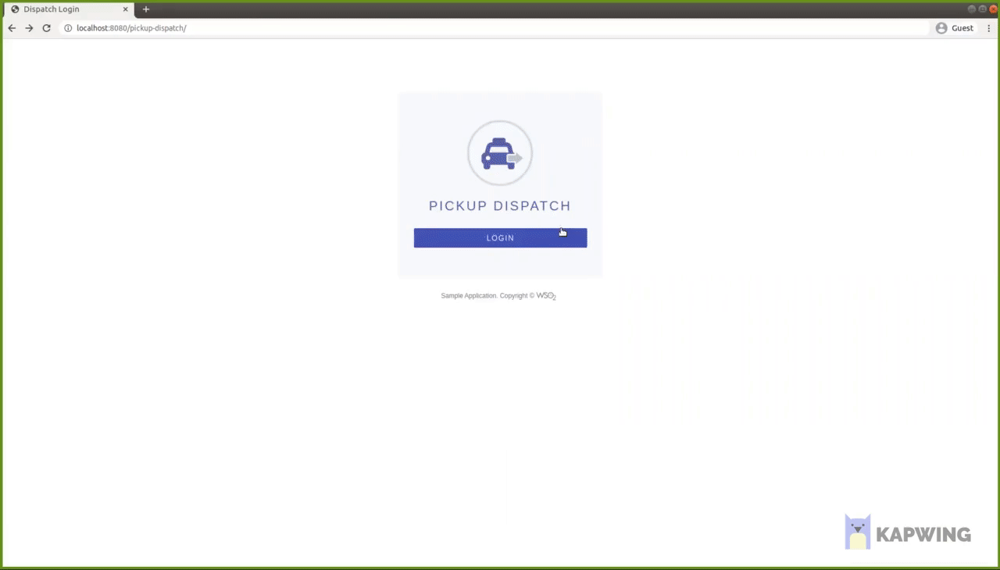

# Implement a custom local authenticator for WSO2 Identity Server

The default authenticator in the WSO2 Identity Server is the Basic authenticator. It is a local authenticator that authenticates the end users using a connected user store and the provided user name and password.

WSO2 Identity Server comes with extensibility which allows you to change the authentication logic which the local users are validated. You only have to write a local authenticator with the customized authentication logic and deploy it in the WSO2 Identity Server.

This guide discusses the three main steps required when introducing custom local authenticator to the WSO2 Identity Server and how you can try out the custom authenticator. 

1. Implement the custom local authenticator
2. Deploy the authenticator in the WSO2 IS 
3. Configure an application with the custom authenticator
4. Trying out the custom authenticator

## Sample scenario

Let’s say we need to login into an application using our telephone number(http://wso2.org/claims/telephone) instead of the username. Therefore if the user enters his/her mobile number as the username, the authentication logic should validate the credentials of the user identified by the given telephone number.

<br>

**NOTE:** 
The customization and configuration details of this guide and the sample are given based on the **WSO2 Identity Server 5.11.0** 

<br>

## Implement the custom local authenticator

1. Create a maven project for the custom authenticator. You can refer to the [pom.xml](./pom.xml) file used to implement the sample local authenticator that is discussed in this guide.
2. The authenticator should be written as an OSGi service and deployed in the WSO2 Identity Server. Therefore, we need to have a [service component class](src/main/java/org/wso2/carbon/identity/sample/local/authenticator/internal/SampleLocalAuthenticatorServiceComponent.java) in our sample authenticator to register it as a local authenticator.
3. The [custom local authenticator](src/main/java/org/wso2/carbon/identity/sample/local/authenticator/SampleLocalAuthenticator.java) should be written by extending the [AbstractApplicationAuthenticator](https://github.com/wso2/carbon-identity-framework/blob/v5.18.187/components/authentication-framework/org.wso2.carbon.identity.application.authentication.framework/src/main/java/org/wso2/carbon/identity/application/authentication/framework/AbstractApplicationAuthenticator.java) class and implementing the [LocalApplicationAuthenticator](https://github.com/wso2/carbon-identity-framework/blob/v5.18.187/components/authentication-framework/org.wso2.carbon.identity.application.authentication.framework/src/main/java/org/wso2/carbon/identity/application/authentication/framework/LocalApplicationAuthenticator.java) class.

### Methods that need to be implemented,

**getFriendlyName():** returns the name you want to display for your custom authenticator.
* Our sample custom local authenticator is named as sample-local-authenticator

**getname():** get the name of the authenticator.

**canHandle():** checks whether the authentication request is valid, according to the custom authenticator’s requirements. The user will be authenticated if the method returns ‘true’. This method also checks whether the authentication or logout request can be handled by the authenticator.
* For example, you can check if the username and password is ‘not null’ in the canHandle method. if that succeeds, the authentication flow will continue (to have the user authenticated).

**processAuthenticationResponse():** Implementation of custom authentication logic happens inside this method.
* In our example, we use the following API where the user claim used as the username is passed along with the value and authenticate the user. Since we are using the telephone number as the login identifier, the prefferedUsernameClaim is http://wso2.org/claims/telephone.
```
AuthenticationResult authenticateWithID(String preferredUserNameClaim, String preferredUserNameValue, Object credential, String profileName) throws UserStoreException;
```

**initiateAuthenticationrequest():** redirects the user to the login page in order to authenticate
* In our sample, the user is redirected to the default WSO2 IS login

**getContextIdentifier():** gets the Context identifier sent with the request. This identifier is used to retrieve the state of the authentication/logout flow.

Now you have successfully implemented the custom authentication logic.

4. To compile the service, go to the root of your project where the pom.xml file is located and run the following command

## Deploy the custom local authenticator in WSO2 IS

1. Once the project is successfully built, you can find the compiled jar file insider `<sample-local-authenticator>/target`.
2. Copy the jar file; in our sample **org.wso2.carbon.identity.sample.local.authenticator-1.0.0.jar** file to the _<IS_HOME>/repository/components/dropins_.

## Configure an application with the custom authenticator

1. Start WSO2 Identity Server
2. Sign in to the Management Console
3. Create a service provider for the application. (We will use the OIDC sample application pickup-dispatch and it is already deployed in the tomcat server locally.)
4. In the service provider configuration, under the **Inbound Authentication Configuration** section, click **OAuth/OpenID Connect Configuration > Configure**. OAuth/OpenID Connect Configuration option. (Refer to the [official documentation](https://is.docs.wso2.com/en/latest/learn/deploying-the-sample-app/#deploying-the-pickup-dispatch-webapp) for more details)
5. Provide the **callback URL** and register it as an OAuth2 client app. For the pickup-dispatch application, the callback URL is _http://localhost.com:8080/pickup-dispatch/oauth2client_
6. Under **Local & Outbound Authentication Configuration**, for the **Authentication Type**, select **Local Authentication** radio button and sample authenticator that we deployed from the drop-down menu.


## Try out the custom authenticator

1. Create a user called with the username **alex**.
2. Since we are trying to login with the user’s mobile number, provide a valid telephone number in the default user profile.
3. Access the sample application. (http://localhost:8080/pickup-dispatch/ for the application that is described here)
4. Click on the Login button
5. Provide the configured telephone number as the username and the corresponding password of the user
6. You will be successfully authenticated to the application.


