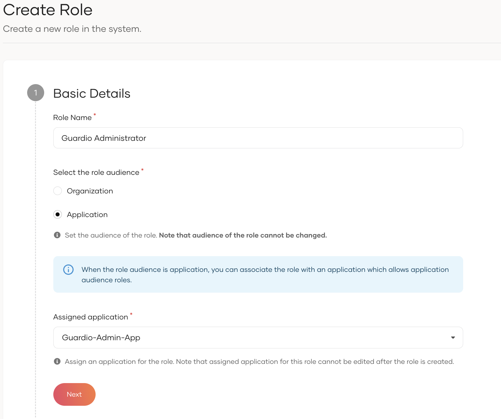
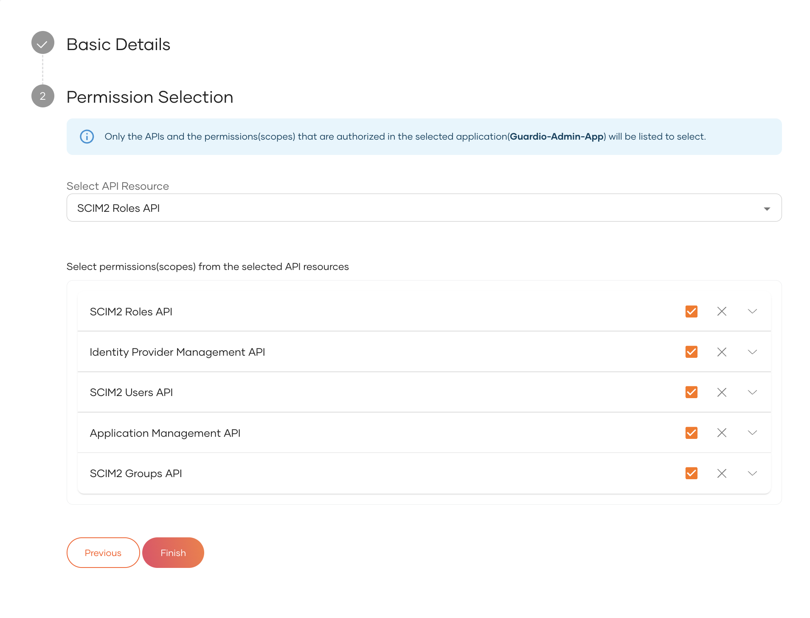

# WSO2 B2B (Business-to-Business) Samples

## ⚠️ Read this first

1. The root of the sample-is repository  will be referred to as `<SAMPLE_IS_HOME>` throughout this document.
2. Required versions
 ```
 Node version >= v16.16.0
 ```
 ```
 NPM version >= 8.11.0
 ```

## 1. Story

## Guardio Insurance

**Guardio** is an automobile insurance service company that provides its services to other business organizations such as automobile lenders
through multiple business applications.

**Guardio-Business-App** and **Guardio-Admin-App** are two such applications.

### Guardio-Business-App

**Guardio-Business-App** is the application that provides insurance and claims settlement capabilities for other
businesses, so that those businesses can use the software for internal requirements.

**Best Car Mart** is one of the customer of **Guardio** Insurance.
**Best Car Mart** organization's staff needs to allow corporate users of their organization to log
into the **Guardio-Business-App** application using their corporate SSO system, to get used to the above-mentioned
capabilities.
To do that, they will configure the **Guardio-Business-App** application to leverage their corporate
IdP for authentication. This will be setup through the **Guardio-Admin-App**.

### Guardio-Admin-App

**Guardio-Admin-App** is the application that provides administrative capabilities to administrators of **Guardio** customer/partner organizations.
The provided administrative capabilities are managing users, assigning roles,
configuring an identity provider for the organization, and customize the login flow of **Guardio-Business-App** business application for their respective organization.

## 2. Setting up

### Step 1: Create an organization
Create an organization named **Best Car Mart**.

### Step 2: Create applications
Now we need **two** applications in the root organization to communicate with the **Guardio-Business-App** and the ****Guardio-Admin-App****.

- Create two OIDC applications using Traditional Web Application template. Name them as **Guardio-Business-App** and **Guardio-Admin-App**.
- Use the following informations to configure the redirect URLs.

#### Step 2.1: In the Guardio-Business-App

>| Property                    |                                    Value/s                                     |
>|--------------------------|:------------------------------------------------------------------------------:|
>| Allowed Grant types      |            `Code`             |
>| Authorized redirect URLs |  `http://localhost:3000/api/auth/callback/wso2is` and `http://localhost:3000`  |
>| Allowed origin           |            `http://localhost:3000 `             |

Also, On the User Attributes tab, click on + Add User Attributes.
Select `Email`, `First Name`, `Last Name`, and `Username` from the list of attributes.

#### Step 2.2: In the Guardio-Admin-App
>| Property                    |                                   Value/s                                   |
>|--------------------------|:----------------------------------------------------------------------------:|
>| Allowed Grant types      |                            `Code`            |
>| Authorized redirect URLs | `http://localhost:3001/api/auth/callback/wso2isAdmin` and `http://localhost:3001` |
>| Allowed origin           |                           `http://localhost:3001`                           |

Also, On the User Attributes tab, click on + Add User Attributes.
Select `Email`, `First Name`, `Last Name`, and `Username` from the list of attributes.

- Navigate to the **Shared Access** tab of both created application.
- Select **Share with all organizations**, if you want to share your application with all existing organizations and every organization that will be created future.
- If you want to share the application with only a set of organizations when the organizations are onboarded, chose **Share with only selected organizations** option and select the required organizations.

### Step 3: Authorize APIs to the applications

- On the root organization's Console, go to `Applications`.
- Select the application you want to authorize the APIs.
- Go to the `API Authorization` tab.
- select the required APIs to be authorized as mentioned follows.

#### Step 3.1: For the Guardio-Business-App

- No API authorization is required

#### Step 3.1: For the Guardio-Admin-App

Select the following APIs under **SYSTEM_ORG** category (organization level APIs).
>| API                      |                                      Scopes                                      |
>|--------------------------|:--------------------------------------------------------------------------------:|
>| SCIM2 Users API      |      `View User`, `List User`, `Create User`, `Update User`, `Delete User`       |
>| SCIM2 Roles API |                            `View Role`, `Update Role`                            |
>| SCIM2 Groups API           |                           `View Group`, `Update Group`                           |
>| Application Management API           |                     `View Application`, `Update Application`                     |
>| Identity Provider Management API           |      `View Identity Provider`, `Create Identity Provider`, `Update Identity Provider`, `Delete Identity Provider`       |


### Step 4: Create roles for the Guardio-Admin-App

- On the root organization's Console, go to User Management > Roles.
- Create a new role with following information.
>| Field                            |                                                                       Value(s)                                                                        |
>|----------------------------------|:-----------------------------------------------------------------------------------------------------------------------------------------------------:|
>| Role Name                        |                                                                `Guardio Administrator`                                                                |
>| Select the role audience                  |                                                                     `Application`                                                                     |
>| Assigned application                |                                                                  `Guardio-Admin-App`                                                                  |
>| Select API Resource | Listed all permissions of `SCIM2 Users API `, `SCIM2 Roles API`, `SCIM2 Groups API`, `Application Management API`, `Identity Provider Management API` |

Role basic information:


Role's permission selection:


```agsl
Note
   
   When you create an application audience role, it will be associated with the selected application. Also that application can use only application audienced roles.
   Instead, you can change the allowed audience to organization audience for role association from the application configuration and use roles created in organization audience.
   Learn more about role management and associating roles to an application through the official documentation
```

- The associated roles of the B2B applications will be shared to the organizations which the application is shared.

### Step 5: Onboard organization administrator
You need to create new users on the organizations with the required permissions to do administrative tasks of Guardio.

To onboard the "Guardio Administrator" of `Best Car Mart` organization:

- Login to root organization in Console application.
- Go to `Organizations` and click the switch icon next to the `Best Car Mart` organization name.
- Go to `User Management` > `Users`. Create a user named `Alex` on the `Best Auto Mart` organization. (Change the name as per username validation in the organization. It may be email/alphanumeric username)
- Go to `User Management` > `Roles`. Select the `Guardio Administrator` role and go to `Users` tab.
- Select the user `Alex` and assign him to the role.

### Step 6: Setup the `config.json` file
<details open>
  <summary>For WSO2 Identity Server</summary>

```yaml
{
  "CommonConfig": {
    "AuthorizationConfig": {
      "BaseOrganizationUrl": "<ROOT ORGANIZATION URL> eg: https://localhost:9443/t/carbon.super"
    }
  },
  "BusinessAppConfig": {
    "AuthorizationConfig": {
      "ClientId": "<CLIENT ID OF THE BUSINESS APP>",
      "ClientSecret": "<CLIENT SECRET OF THE BUSINESS APP>"
    },
    "ApplicationConfig": {
      "HostedUrl": "http://localhost:3000",
      "APIScopes": [
        "openid",
        "email",
        "profile",
        "internal_login"
      ],
      "Branding": {
        "name": "Guardio Insurance",
        "tag": "Anytime . Anywhere"
      }
    },
    "ManagementAPIConfig": {
      "SharedApplicationName": "Guardio-Business-App",
      "UserStore" : "PRIMARY"
    }
  },
  "BusinessAdminAppConfig": {
    "AuthorizationConfig": {
      "ClientId": "<CLIENT ID OF THE ADMIN APP>",
      "ClientSecret": "<CLIENT SECRET OF THE ADMIN APP>"
    },
    "ApplicationConfig": {
      "HostedUrl": "http://localhost:3001",
      "APIScopes": [
        "openid",
        "email",
        "profile",
        "internal_login",
        "internal_org_user_mgt_view",
        "internal_org_user_mgt_list",
        "internal_org_user_mgt_update",
        "internal_org_user_mgt_delete",
        "internal_org_user_mgt_create",
        "internal_org_idp_view",
        "internal_org_idp_create",
        "internal_org_idp_update",
        "internal_org_idp_delete",
        "internal_org_application_mgt_view",
        "internal_org_application_mgt_update",
        "internal_org_organization_view",
        "internal_org_role_mgt_view",
        "internal_org_role_mgt_update",
        "internal_org_group_mgt_view",
        "internal_org_group_mgt_update"
      ],
      "Branding": {
        "name": "Guardio Insurance - Administrator Application",
        "tag": "Administrator Application"
      }
    }
  }
}
```
</details>


<details open>
  <summary>For Asgardeo</summary>


```yaml
{
  "CommonConfig": {
    "AuthorizationConfig": {
      "BaseOrganizationUrl": "<ROOT ORGANIZATION URL> eg: https://api.asgardeo.io/t/guardio"
    }
  },
  "BusinessAppConfig": {
    "AuthorizationConfig": {
      "ClientId": "<CLIENT ID OF THE BUSINESS APP>",
      "ClientSecret": "<CLIENT SECRET OF THE BUSINESS APP>"
    },
    "ApplicationConfig": {
      "HostedUrl": "http://localhost:3000",
      "APIScopes": [
        "openid",
        "email",
        "profile",
        "internal_login"
      ],
      "Branding": {
        "name": "Guardio Insurance",
        "tag": "Anytime . Anywhere"
      }
    },
    "ManagementAPIConfig": {
      "SharedApplicationName": "Guardio-Business-App",
      "UserStore" : "DEFAULT"
    }
  },
  "BusinessAdminAppConfig": {
    "AuthorizationConfig": {
      "ClientId": "<CLIENT ID OF THE BUSINESS ADMIN APP>",
      "ClientSecret": "<CLIENT SECRET OF THE BUSINESS ADMIN APP>"
    },
    "ApplicationConfig": {
      "HostedUrl": "http://localhost:3001",
      "APIScopes": [
        "openid",
        "email",
        "profile",
        "internal_login",
        "internal_org_user_mgt_view",
        "internal_org_user_mgt_list",
        "internal_org_user_mgt_update",
        "internal_org_user_mgt_delete",
        "internal_org_user_mgt_create",
        "internal_org_idp_view",
        "internal_org_idp_create",
        "internal_org_idp_update",
        "internal_org_idp_delete",
        "internal_org_application_mgt_view",
        "internal_org_application_mgt_update",
        "internal_org_organization_view",
        "internal_org_role_mgt_view",
        "internal_org_role_mgt_update",
        "internal_org_group_mgt_view",
        "internal_org_group_mgt_update"
      ],
      "Branding": {
        "name": "Guardio Insurance - Administrator Application",
        "tag": "Administrator Application"
      }
    }
  }
}
```
</details>

setup the config json file as mentioned above.

### Step 7: Run the Guardio-Admin-App

- First, run the development server for the **Guardio-Admin-App**

```bash
 # From `<SAMPE_IS_HOME>/b2b-sample`
 npm install
 nx serve business-admin-app
```
> **_NOTE:_** If `nx serve business-admin-app` produces an error, try using `npx nx serve business-admin-app`.

- Open [http://localhost:3001](http://localhost:3001) with your browser to see the result.
- Click `Sign in`.
- Select the `Sign in With SSO` option.
- Type `Best Car Mart` when pop up to type the organization name and click `Submit`.
- You will get the login page of `Best Car Mart` organization.
- Provide the credentials of `Alex` and login.

### Step 8: Setup the identity provider for the Guardio-Business-App

```agsl
Prerequisite

     You have to configure an external identity provider(IdP) by creating OAuth application thier side. 
     For testing purpouse:
      - If you are trying the flow in WSO2 Identity Server - You can use another WSO2 Identity Server instance or an Asgardeo root organization as the external IdP.
      - If you are trying the flow in Asgardeo - You can use another Asgardeo root organization as the external IdP.
      
    Make sure that the configured IdP will share `Email`, `First Name`, `Last Name`, and `Username` attributes of the authenticating user with WSO2 Identity Server/Asgardeo.
      - If your external IdP is another WSO2 IS instance or Asgardeo root organization,
        On the User Attributes tab of created Oauth2 application, click on + Add User Attributes. Select `Email`, `First Name`, `Last Name`, and `Username` from the list of attributes.
```

- Go to the identity providers section in the **Guardio-Admin-App** and fill in the form to create an identity provider for the `Best Car Mart` organization.

- After creating the IdP add it to the login flow of **Guardio-Business-App** by clicking on `Add to Login Flow`.

### Step 9: Create a corporate user

- You need to create a new corporate user to access the **Guardio-Business-App**.
- Log in to the external IdP you configured in step 10.
- Create a user named `John`.

### Step 10: Run the Guardio-Business-App

- First, run the development server for the **Guardio-Business-App**.

- Open a separate terminal and run
```bash
 # From `<SAMPE_IS_HOME>/b2b-sample`
 nx serve business-app
```
> **_NOTE:_** If `nx serve business-admin-app` produces an error, try using `npx nx serve business-admin-app`.

- Open a **private browser** and type [http://localhost:3000](http://localhost:3000) with your browser to see the result.
- Click `Sign in`.
- Select the `Sign in With SSO` option.
- Type `Best Car Mart` when pop up to type the organization name and click `Submit`.
- You will be redirected to the configured external IdP.
- Provide the credential of `John` and authenticate him.

---

#### Documentations

* [Documentation for setting this sample application in WSO2 Identity Server](https://is.docs.wso2.com/en/next0/guides/organization-management/try-a-b2b-use-case/)
* [Documentation for setting this sample application in an Asgardeo](https://wso2.com/asgardeo/docs/guides/organization-management/manage-b2b-organizations/try-a-b2b-use-case/)

---
## When creating a new library

> After creating a new library in the project (using nx). Please make sure to append `@b2bsample/` before the relevant
> path key in the `tsconfig.base.json`. 
